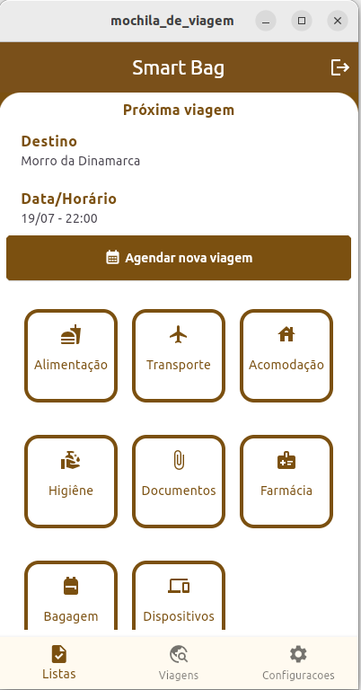

# Smartbag Repository

## 📦 About the Project

**Smartbag-app** is an application developed using **Laravel** as its backend core and **Flutter** for the frontend.  
It offers a practical way to organize and manage lists of items for various purposes — such as moving, traveling, exchange programs, or any other use the user finds suitable.

The system features a dynamic item list, divided into predefined sections. Users simply select the section in which they want to add items.

> ⚠️ The item section management is still under development.

Smartbag also includes a **trip registration** feature, with a user-friendly interface similar to the item list, making it easy to use on a daily basis.

The upcoming trip (closest to the current date) is automatically displayed on the main screen. All trips can be managed through their dedicated section.

---

## 🎞️ Preview




## ⚙️ About this Repository

This repository automates the installation process for both Smartbag components:

- [API](https://github.com/CleisonFreitas/smartbag-app-api.git)
- [APP](https://github.com/CleisonFreitas/smartbag-app-ui.git)

The script handles:

1. Installing the Laravel API using Docker (Laravel Sail)
2. Asking if you'd like to install the Flutter app as well

---

## 🚀 How to Run the Script

### 1. Clone this repository:

```bash
git clone https://github.com/CleisonFreitas/smartbag-repository.git
cd smartbag-repository
```

### 2. Make the script executable
```bash
chmod +x deploy.sh
```

### 3. Run
```bash
./deploy_smartbag_app.sh
```